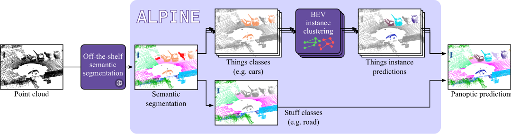

# Clustering is back: Reaching state-of-the-art LiDAR instance segmentation without training

Official implementation of the method **ALPINE**. Check out the [article](https://arxiv.org/abs/2503.13203) for more details!

🔥 ALPINE reached the first place on the [Panoptic benchmark of SemanticKITTI](https://codalab.lisn.upsaclay.fr/competitions/7092#results), using [UniSeg](https://arxiv.org/abs/2304.03493) semantic predictions.

**Clustering is back: Reaching state-of-the-art LiDAR instance segmentation without training**,
by *Corentin Sautier, Gilles Puy, Alexandre Boulch, Renaud Marlet, and Vincent Lepetit*



ALPINE takes semantic LiDAR predictions as input, and predicts instance masks, evaluated on LiDAR panoptic benchmarks. 

If you use ALPINE in your research, please cite:
```
@article{sautier2025alpine,
  title = {Clustering is back: Reaching state-of-the-art {LiDAR} instance segmentation without training},
  author = {Corentin Sautier and Gilles Puy and Alexandre Boulch and Renaud Marlet and Vincent Lepetit},
  journal={arxiv:2503.13203},
  year = {2025}
}
```

## Using Alpine in your own codebase

First install Alpine using:

`pip install .`

Alpine's usage is similar to other scikit-learn clustering:

```
from alpine import Alpine
# Provide your own point cloud X and semantic labels y
X = np.array([[0, 0], [1, 1], [2, 2], [3, 3]])
y = np.array([0, 0, 1, 1])
# Provide a list of 'thing' classes matching separable objects in your semantic labels
thing_indexes = [0, 1]
# Provide a dict of standard size of object for each 'thing' class
thing_bboxes = {0: [2., 2.], 1: [2., 2.]}
alpine = Alpine(thing_indexes, thing_bboxes, split=True)
instance_labels = alpine.fit_predict(X, y)
```

Other parameters include whether or not to activate the box splitting (default is false), the number of neighbors k and the margin of the box splitting.

## Evaluation Alpine in our codebase

### Datasets

This project has been adapted to [SemanticKITTI](http://www.semantic-kitti.org/tasks.html#semseg), [nuScenes](https://www.nuscenes.org/lidar-segmentation) and [SemanticPOSS](http://www.poss.pku.edu.cn/semanticposs.html). Please use the following convention (or provide the `--path_dataset` argmument):

```
UNIT
├── datasets
│   ├── nuscenes
│   │   │── v1.0-trainval
│   │   │── samples
│   │   │── sweeps
│   ├── semantic_kitti
│   │   │── sequences
│   ├── semantic_poss
│   │   │── sequences
```

### Use your own semantic masks

For SemanticKITTI and SemanticPOSS, you should preferably use the [official prediction formatting](http://www.semantic-kitti.org/dataset.html#format) requested by SemanticKITTI.

For nuScenes you can either use the [semantic segmentation formatting](https://www.nuscenes.org/lidar-segmentation//#results-format) or the [panoptic segmentation formatting](https://www.nuscenes.org/panoptic/#results-format).

### Running ALPINE

ALPINE can be ran with the command:

`python alpine_semantickitti.py --path_to_files [path] --split`

Other arguments can disable the box splitting for faster runtime at some performance cost, or save the predictions to disk.

### Running ALPINE with WaffleIron predictions

To obtain semantic predictions on SemanticKITTI using [WaffleIron](https://github.com/valeoai/WaffleIron), first install WaffleIron and its dependencies, then you can run the following code:

```
cd waffleiron

wget https://github.com/valeoai/WaffleIron/releases/download/v0.2.0/waffleiron_kitti.tar.gz
tar -xvzf waffleiron_kitti.tar.gz

python predict_semantickitti.py \
--path_dataset ../semantic_kitti/ \
--ckpt ./pretrained_models/WaffleIron-48-256__kitti/ckpt_last.pth \
--config WaffleIron-48-256__kitti.yaml \
--result_folder ./predictions_kitti \
--phase val \
--num_votes 12 \
--num_workers 6
```

Predicted semantic segments will be generated in *waffleiron/predictions_kitti* and can be evaluated running:

`python alpine_semantickitti.py --path_to_files waffleiron/predictions_kitti --split`

### Ensembling

In the article, we ran ensembling by summing predicted semantic probabilities together. To obtain this behavior, you can provide multiple *path_to_files* with output probabilities. This ensembling method might not be effective for any combination of predictions.

## AlpineAdaptive Enhancements

AlpineAdaptive extends the original ALPINE algorithm with three targeted enhancements designed to improve Panoptic Quality (PQ), particularly by reducing false positive (FP) and false negative (FN) instance counts - the primary source of Recognition Quality (RQ) loss.

### Analysis of PQ Bottlenecks

Panoptic Quality decomposes as:

$$PQ = SQ \times RQ$$

where Segmentation Quality (SQ) measures how well matched instance masks overlap, and Recognition Quality (RQ) measures how many instances are correctly detected:

$$RQ = \frac{|TP|}{|TP| + \frac{1}{2}|FP| + \frac{1}{2}|FN|}$$

Empirically, RQ is the dominant loss factor (e.g., RQ_things ~ 0.72 vs SQ_things ~ 0.78 on nuScenes with WaffleIron). Two failure modes drive RQ down:

1. **False merges** (FN↑): Separate nearby objects connected by uncertain boundary points that fall within the distance threshold, collapsing two instances into one.
2. **False fragments** (FP↑): Sparse or noisy regions of a valid object have gaps exceeding the threshold, producing spurious small clusters.

The root cause is the binary edge thresholding in `_clusterize()`:

```python
weights = (dist < th).astype("float")  # Original: hard 0/1 cliff
```

### Enhancement 1: Probability-Modulated Edge Thresholding

Instead of a fixed binary threshold, the effective connection threshold for each edge is modulated by the geometric mean of both endpoints' class probabilities:

$$th_{\text{eff}}(i,j) = th \cdot \sqrt{p_i \cdot p_j}$$

where $p_i$ is point $i$'s softmax probability for the thing class being clustered.

**Behavior:**
- Both points confident ($p \approx 1.0$): threshold unchanged - same as vanilla ALPINE
- Either point uncertain ($p \approx 0.3$): effective threshold shrinks by ~$\sqrt{0.3} \approx 0.55\times$ - harder to connect
- Both uncertain: threshold shrinks further - very unlikely to form edge

This directly targets the **false merge** failure mode: misclassified or boundary points that act as "bridges" between separate instances typically have low class probability. By making the threshold confidence-aware, these weak bridges are severed without affecting connections between confident points within the same instance.

**Implementation:** When the entry point has access to the full probability matrix (logits/softmax from the backbone), it passes `probs` to `fit_predict()`. When probabilities are unavailable (e.g., oracle mode or pre-argmaxed predictions), `probs=None` falls back to vanilla behavior.

### Enhancement 2: Small Cluster Reassignment

After initial clustering, clusters with fewer than `min_cluster_size` points (default: 3) are reassigned to the spatially nearest large cluster via kNN lookup.

**Rationale:** Tiny clusters (1–2 points) almost always represent noise - either misclassified points or sparse fragments of a larger object. The PQ evaluator counts predicted instances with ≥ `min_points` (50 for SemanticKITTI) as FP if unmatched, but even sub-threshold fragments can interfere with IoU computation of neighboring instances. Reassigning them to the nearest valid cluster:

- Eliminates potential FP from noise fragments
- Improves SQ of adjacent instances by adding correctly-classified points back
- Negligible computational cost (single kNN query on small point set)

**Usage:** Controlled by `--min_cluster_size` (default 3, set to 0 to disable).

### Enhancement 3: Bug Fix - kNN Neighbor Count

The original `__init__` contained a variable shadowing bug:

```python
# Original (buggy):
for k, v in thing_bboxes.items():  # 'k' overwrites the constructor parameter!
    ...
self.k = k  # Now equals last dict key (e.g., 8 on SemanticKITTI) instead of 32
```

This meant the kNN graph was built with only 8 neighbors instead of the intended 32, producing a sparser graph that misses connections within valid instances. The fix renames the loop variable to `cls_key`, ensuring `self.k` retains the user-specified value.

### Combined Effect

| Enhancement | Targets | PQ Component |
|---|---|---|
| Probability-modulated edges | False merges (bridges through uncertain points) | RQ↑ (FN↓) |
| Small cluster reassignment | False fragments (noise clusters) | RQ↑ (FP↓), SQ↑ |
| k bug fix | Sparse graph (missed intra-instance connections) | RQ↑ (FP↓), SQ↑ |

All three are **backward-compatible**: with `probs=None` and `min_cluster_size=0`, behavior is identical to vanilla ALPINE (aside from the bug fix).

### Usage

```bash
# SemanticKITTI with all enhancements (probabilities auto-detected from logit files)
python alpine_semantickitti.py --path_to_files [path] --split --min_cluster_size 3

# Disable small cluster reassignment
python alpine_semantickitti.py --path_to_files [path] --split --min_cluster_size 0
```

## Acknowledgement

We want to acknowledge the authors of [MODEST](https://github.com/YurongYou/MODEST/) from which we reuse a box fitting algorithm.

We incorporated a minimal working example of [WaffleIron](https://github.com/valeoai/WaffleIron/) into this repository to provide working semantic masks.
